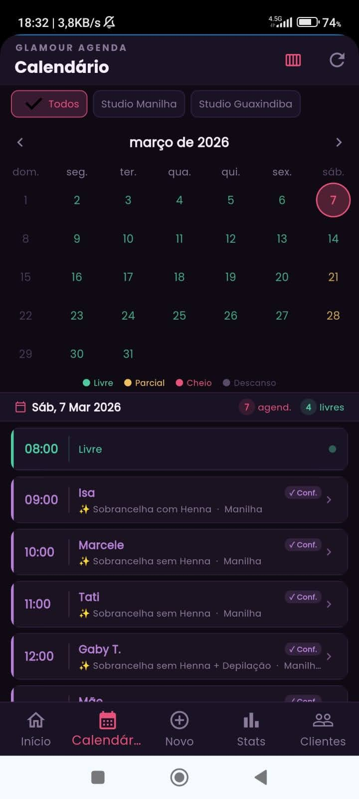
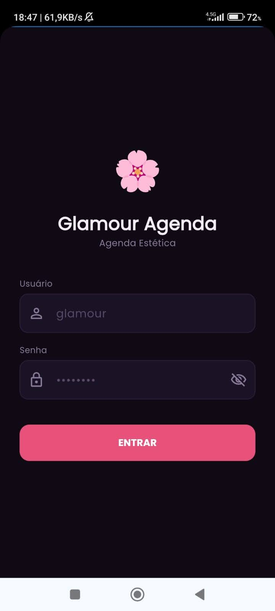
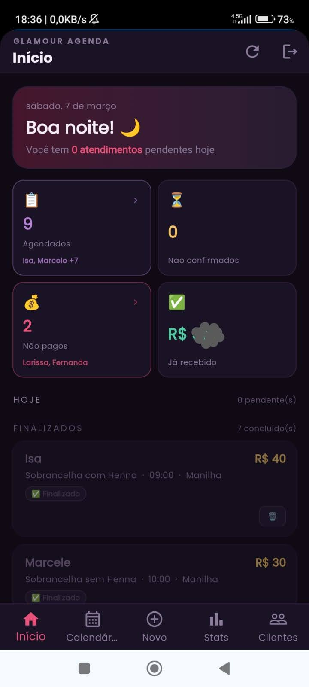
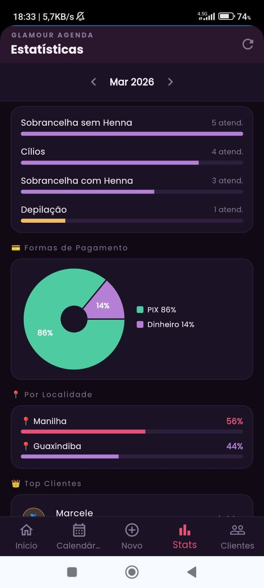

# 🌸 Glamour Agenda

> Sistema de agendamento para estúdio de beleza — feito com carinho para facilitar a vida da minha esposa.

---

## 💡 A ideia

Minha esposa gerenciava os agendamentos do estúdio dela de forma manual — caderno, mensagens no WhatsApp, anotações perdidas. O objetivo foi simples: **transformar esse problema real em uma solução digital**, onde ela consegue ver, criar e controlar todos os agendamentos de qualquer lugar, pelo próprio celular.

---

## ✨ O que o app faz

- 📅 **Calendário visual** — dias coloridos por disponibilidade (livre, parcial, lotado)
- ➕ **Novo agendamento** — nome da cliente, procedimentos, data, horário, local e valor
- 💅 **Múltiplos procedimentos** — combina cílios + sobrancelha + outros em um só atendimento
- ✅ **Confirmar e pagar** — registra presença e forma de pagamento (PIX, cartão, dinheiro)
- 📊 **Estatísticas mensais** — receita, procedimentos mais realizados, top clientes e formas de pagamento

---

## 📸 Telas

  
  
  
  

---

## 📱 Flutter + Web = liberdade

O app foi desenvolvido em **Flutter** com a intenção de rodar no iPhone como aplicativo nativo. Porém, publicar na App Store exige uma conta Apple Developer ($99/ano) — o que inviabilizou essa etapa por enquanto.

A boa notícia: **Flutter é multiplataforma**. Com isso, o app roda perfeitamente no navegador do celular, sem precisar instalar nada. Ela acessa pela URL e usa como se fosse um app.

---

## 🛠️ Tecnologias

| Camada | Tecnologia |
|---|---|
| Frontend | Flutter Web + Riverpod |
| Backend | Node.js + Express |
| Banco de dados | MongoDB Atlas |
| Deploy frontend | Netlify |
| Deploy backend | Render |

---

## 🔗 Links

- 🖥️ **Aplicação:** [glamour-agenda.netlify.app](https://glamour-agenda.netlify.app)
- 📦 **Frontend:** [github.com/Michaelrodriguesds/GlamourFrontend](https://github.com/Michaelrodriguesds/GlamourFrontend)
- ⚙️ **Backend:** [github.com/Michaelrodriguesds/GlamourBackend](https://github.com/Michaelrodriguesds/GlamourBackend)
- 📄 **Documentação:** [Ver PDF](./docs/documentacao.pdf)

---

## 📚 Aprendizados

Projeto simples com muito aprendizado na prática — arquitetura cliente-servidor, autenticação JWT, deploy em nuvem, responsividade mobile e integração Flutter + API REST. Mais do que um app, foi um exercício de **entender um problema real e transformá-lo em solução**.